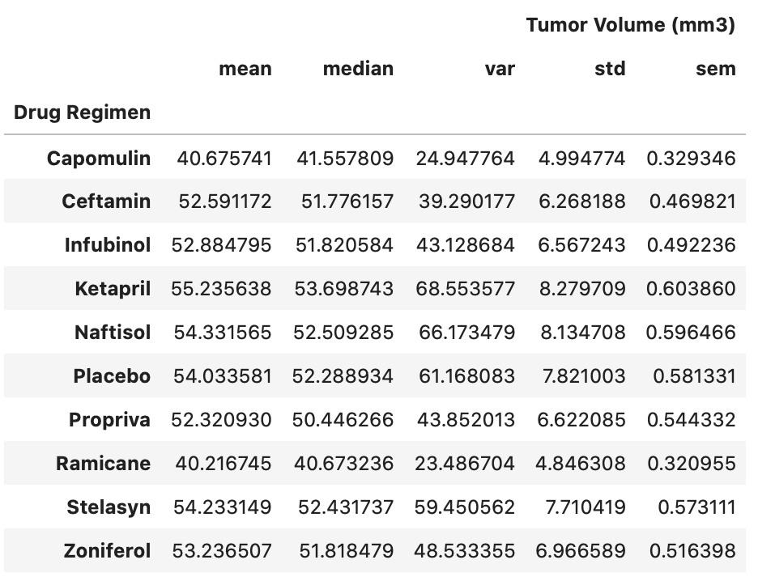
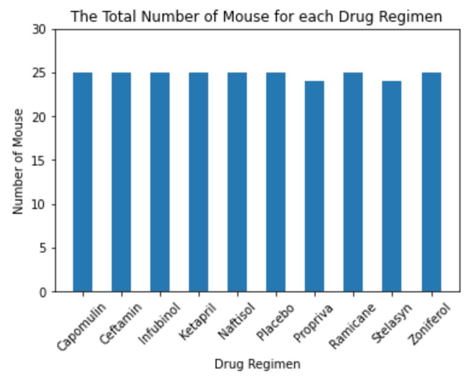
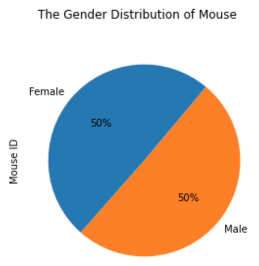
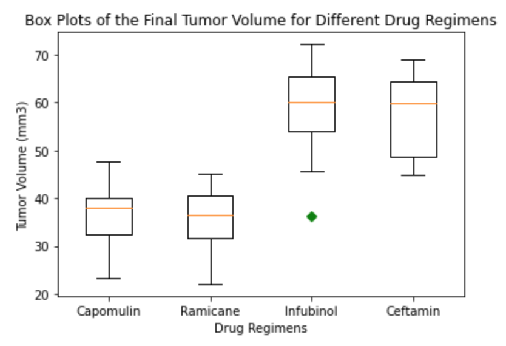
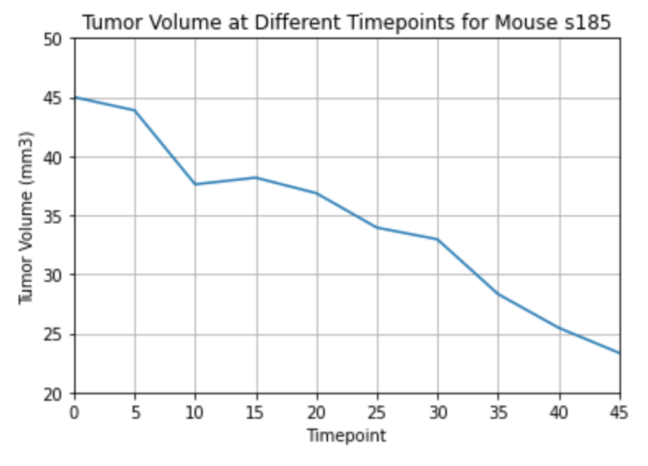
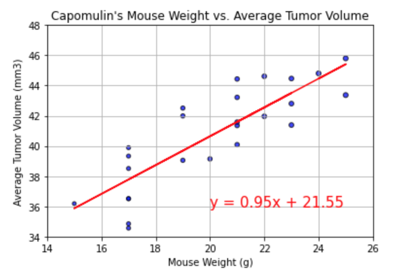

# Matplotlib Challenge - The Power of Plots

## Introduction

In this challenge, I've been given access to the complete data from Pymaceuticals Inc.'s most recent animal study. By using Python and Matplotlib to analyse and visualise the data.

In this study, 249 mice identified with SCC tumor growth were treated through a variety of drug regimens. Over the course of 45 days, tumor development was observed and measured. The purpose of this study was to compare the performance of Pymaceuticals' drug of interest, Capomulin, versus the other treatment regimens. You have been tasked by the executive team to generate all of the tables and figures needed for the technical report of the study. The executive team also has asked for a top-level summary of the study results.

## Data
* Mouse Metadata: [Mouse_metadata.csv](Resources/Mouse_metadata.csv)
* Study Results: [Study_results.csv](Resources/Study_results.csv)

## Analysis
* Generate a summary statistics table consisting of the mean, median, variance, standard deviation, and SEM of the tumor volume for each drug regimen.

* Generate a bar plot using both Pandas's `DataFrame.plot()` and Matplotlib's `pyplot` that shows  the number of total mice for each treatment regimen throughout the course of the study.

* Generate a pie plot using both Pandas's `DataFrame.plot()` and Matplotlib's `pyplot` that shows the distribution of female or male mice in the study.

* Calculate the final tumor volume of each mouse across four of the most promising treatment regimens: Capomulin, Ramicane, Infubinol, and Ceftamin. Calculate the quartiles and IQR and quantitatively determine if there are any potential outliers across all four treatment regimens.

* Using Matplotlib, generate a box and whisker plot of the final tumor volume for all four treatment regimens and highlight any potential outliers in the plot by changing their color and style.

* Select a mouse that was treated with Capomulin and generate a line plot of tumor volume vs. time point for that mouse.

* Generate a scatter plot of mouse weight versus average tumor volume for the Capomulin treatment regimen.

* Calculate the correlation coefficient and linear regression model between mouse weight and average tumor volume for the Capomulin treatment. Plot the linear regression model on top of the previous scatter plot.

## Observation & Insights
1. By looking at the gender distribution and drug regimens, we can see the study has conducted with almost even spread of mouse in both genders, and the unique number of mice were almost the same (differ by 1) across the drug regimens. Which is stating the study results are not bias on gender or drug regimens.

2. When we look at the potential outliers, there are only 3 potential outliers across the 4 drug regimens. With a small number of outliers, it is supporting the validation and the representativeness of the study results. Also indicating the data has not been skewed towards a particular side.

3. With the line chart, we discovered, there is a negative correlation between timepoint and tumor volume. When the timepoint increases the tumor volume decreases. However, from the scatter plot between mouse weight and average tumor volume, it indicated a strong positive correlation. When the mouse is having a heavier weight there is an 84% probability that it has a higher average tumor volume.

## Tools
* Python
* Matplotlib
